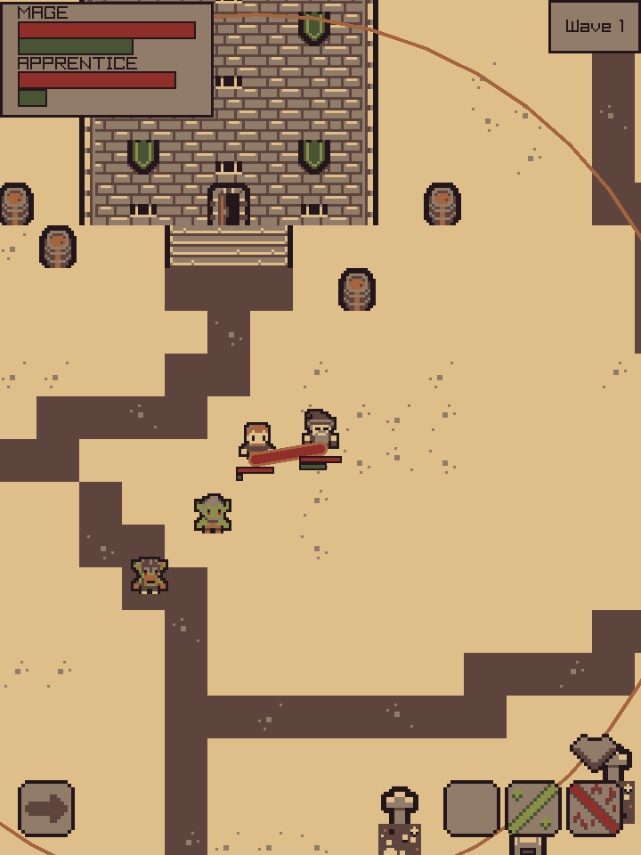
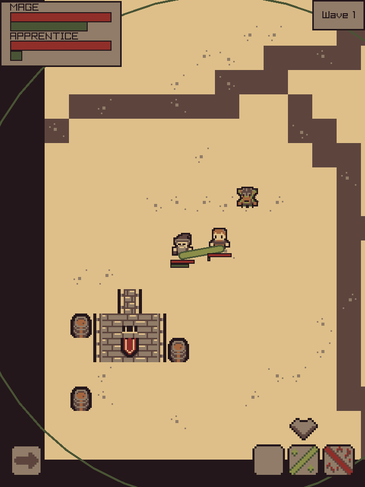
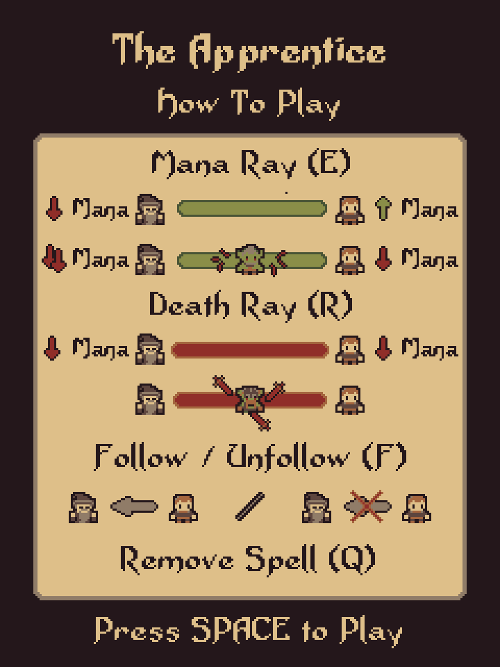

## The Apprentice

### Description

Made for **raylib NEXT gamejam**.

Master and student unite in this magical action game. Cast spells in sync with your apprentice to defeat waves of enemies, proving that two wizards are stronger than one.

> This is my first gamejam submission and the first *kinda* completed game ever. The in-game ui is bad, there are no collisions and there are only 2 spells. However, I really liked the process of creating a game and I'm looking forward to polish it after the winners are decided.

### Features

 - Control wizard and apprentice at the same time.
 - Cast spells in tandem to defeat endless hordes of enemies.

### Controls

Keyboard:
 - `WASD`: Move
 - `Q`: Remove Spell
 - `E`: Mana Ray Spell
 - `R`: Death Ray Spell
 - `F`: Follow/Unfollow

Touch controls:
 - Touch and Drag to Move
 - Click on Icons to change spells and Follow

### Screenshots

### Developers

 - VSngg - Programming, Art

### Links

 - itch.io Release: $(itch.io Game Page)

### Resources used

 - Palette: https://lospec.com/palette-list/dead-weight-8
 - Art based on "Tiny Dungeon" by Kenny licensed CC0: https://kenney.nl/assets/tiny-dungeon
 - "Folly of Man" by Vandalorum licensed CC-BY 4.0, CC-BY 3.0: https://opengameart.org/content/dark-dungeon-music
 - stb_ds.h: https://github.com/nothings/stb/blob/master/stb_ds.h

### License

This project sources are licensed under an unmodified zlib/libpng license, which is an OSI-certified, BSD-like license that allows static linking with closed source software. Check [LICENSE](LICENSE) for further details.

*Copyright (c) 2024 Vladimir Sotskov (VSngg)*
